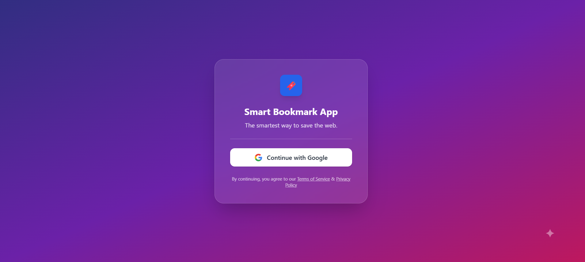

# Smart Bookmark App

A full-stack real-time bookmark manager built using Next.js (App Router) and Supabase.  
The application allows users to securely sign in using Google OAuth and manage private bookmarks with real-time synchronization across multiple browser tabs.

The project is deployed on Vercel and uses Supabase for authentication, database, row-level security, and realtime subscriptions.

---

## Live Demo

Live URL: https://smart-bookmark-app-hazel.vercel.app/ 
GitHub Repository: https://github.com/Sksohel2003/smart-bookmark-app

---

### ScreenShots


## Project Overview

The Smart Bookmark App enables users to:

- Authenticate using Google OAuth
- Add bookmarks (title and URL)
- Edit existing bookmarks
- Delete bookmarks
- View bookmarks in real-time across multiple tabs
- Access only their own data (strict per-user isolation)

Each user’s data is secured using Supabase Row Level Security (RLS), ensuring that no user can view or modify another user’s bookmarks.

---

## Key Features

### 1. Google Authentication
Authentication is handled through Supabase Auth with Google as the only provider.  
There is no email/password flow.

### 2. Private Data per User
Bookmarks are associated with the authenticated user via `user_id`.  
Row Level Security policies enforce:

- SELECT: Only fetch records where `user_id = auth.uid()`
- INSERT: Allow only if `user_id = auth.uid()`
- UPDATE: Allow only if `user_id = auth.uid()`
- DELETE: Allow only if `user_id = auth.uid()`

This guarantees complete data isolation.

### 3. Real-Time Synchronization
The app subscribes to Supabase `postgres_changes` events for the `bookmarks` table.

Each user listens only to their own records using a filtered realtime subscription:

```
filter: user_id=eq.${user.id}
```


If a bookmark is added, edited, or deleted in one tab, other open tabs update instantly without a page refresh.

### 4. Production Deployment
The project is deployed on Vercel with:

- Environment variables configured securely
- Auto-deployment via GitHub integration
- Supabase redirect URLs configured for production

---

## Tech Stack

### Frontend
- Next.js 14 (App Router)
- React
- TypeScript
- Tailwind CSS

### Backend / Services
- Supabase
  - Authentication (Google OAuth)
  - PostgreSQL Database
  - Row Level Security (RLS)
  - Realtime subscriptions

### Deployment
- Vercel (Hobby plan)
- GitHub (Version Control)

---

## Folder Structure

```
smart-bookmark-app/
│
├── public/
│
├── src/
│ ├── app/
│ │ ├── login/
│ │ │      └── page.tsx
│ │ ├── dashboard/
│ │ │      └── page.tsx
│ │ ├── page.tsx
│ │ ├── layout.tsx
│ │ └── globals.css
│ │
│ └── lib/
│      └── supabaseClient.ts
│
├── tailwind.config.js
├── postcss.config.js
├── package.json
└── README.md
```


### Explanation

- `app/` – App Router pages and layouts  
- `login/` – Google authentication page  
- `dashboard/` – Bookmark management and realtime logic  
- `lib/supabaseClient.ts` – Centralized Supabase client configuration  
- `globals.css` – Tailwind base styles  
- `tailwind.config.js` – Tailwind content configuration  

---

## Application Flow

1. User opens the application.
2. If not authenticated, they are redirected to `/login`.
3. User signs in using Google OAuth.
4. After authentication, user is redirected to `/dashboard`.
5. Dashboard fetches user-specific bookmarks.
6. Realtime subscription is established for the logged-in user.
7. Add / Edit / Delete operations update:
   - The database
   - The current UI
   - All other open tabs in real time

---

## Database Schema


Table: `bookmarks`
```
-----------------------------------------------------------
| Column     | Type      | Description                    |
|------------|-----------|--------------------------------|
| id         | uuid      | Primary key                    |
| user_id    | uuid      | References authenticated user  |
| title      | text      | Bookmark title                 |
| url        | text      | Bookmark URL                   |
| created_at | timestamp | Creation timestamp             |
-----------------------------------------------------------
```

---

## Environment Variables

Create a `.env.local` file in the root directory:

```
NEXT_PUBLIC_SUPABASE_URL=your_supabase_project_url
NEXT_PUBLIC_SUPABASE_ANON_KEY=your_supabase_anon_key
```


These must also be configured in Vercel under:

Project → Settings → Environment Variables

---

## Installation & Setup (Local Development)

### 1. Clone Repository
```
git clone https://github.com/your-username/smart-bookmark-app.git
cd smart-bookmark-app
```

### 2. Install Dependencies

```
npm install
```

### 3. Configure Environment Variables

Create `.env.local` with Supabase credentials.

### 4. Run Development Server
```
npm run dev
```
Open: `http://localhost:3000`


---

## Supabase Configuration Steps

1. Create new Supabase project
2. Enable Google OAuth under Authentication → Providers
3. Configure OAuth redirect URL
4. Create `bookmarks` table
5. Enable Row Level Security (RLS)
6. Add policies for SELECT, INSERT, UPDATE, DELETE
7. Enable Realtime replication for the table

---

## Challenges Faced & Solutions

### 1. 403 Forbidden During Insert
Cause: RLS policy required `user_id = auth.uid()` but `user_id` was not being sent during insert.  
Solution: Explicitly included `user_id` in insert operation.

### 2. Updates Rolling Back After Refresh
Cause: UPDATE policy missing in RLS configuration.  
Solution: Added UPDATE policy enforcing `user_id = auth.uid()`.

### 3. Realtime Working Locally But Not In Production
Cause: Supabase Realtime respects RLS. Subscription was not filtered by user.  
Solution: Added filtered subscription:

```
filter: user_id=eq.${user.id}
```


### 4. Tailwind Configuration Issues
Cause: Duplicate configuration files and incorrect content paths.  
Solution: Cleaned configuration and ensured correct content scanning.

---

## Why Supabase?

Supabase was chosen because it provides:

- Built-in authentication
- Postgres database
- Row Level Security
- Realtime subscriptions
- Minimal backend setup

It allowed building a secure, production-ready application without managing a separate backend server.

---

## Future Improvements

- Dark mode toggle
- Bookmark categorization
- Search and filtering
- Drag-and-drop reordering
- Improved loading states and animations

---

## Author

Sohel
GitHub: https://github.com/Sksohel2003 
Email: shaiksohel120@gmail.com
